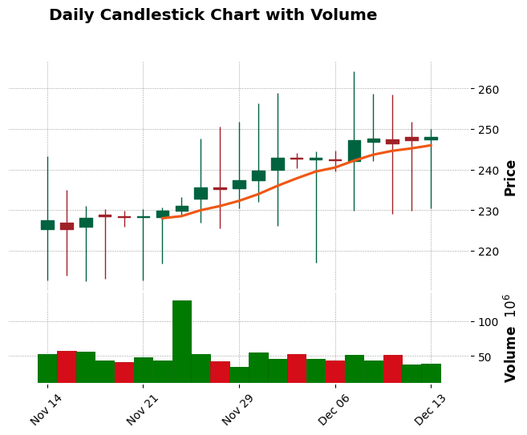
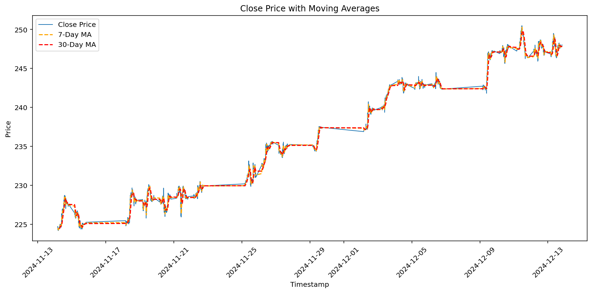
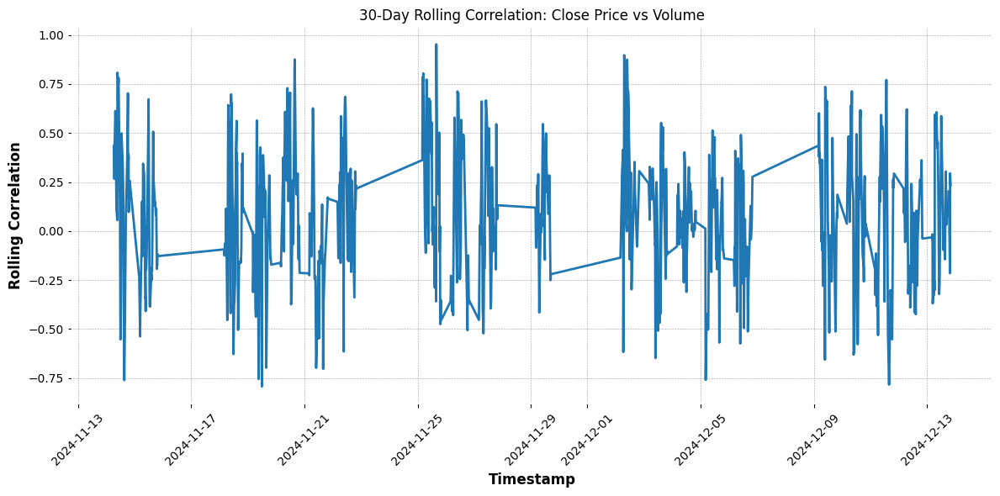

# finmarket-pipeline

# Advanced Financial Analytics and Prediction System

## 1. Summary  
A full-stack financial analytics pipeline combining **Golang**, **Rust**, **SQL**, and **Python** for ingesting, processing, analyzing, and predicting market trends with machine learning.

## 2. High-Value Summary  
- **Multi-Technology Integration**: Efficient **Go**-based data ingestion, high-performance **Rust** processing, and advanced **SQL** analytics.  
- **Predictive Modeling**: Comprehensive **Python ML pipeline** with models like Stacked Ensembles, Random Forest, and Neural Networks.  
- **High-Value Insights**: Rolling correlations, volatility analysis, moving averages, and **visualized predictions** for financial forecasting.

---

## Project Layout

### 1. **Data Ingestion**  
**Technology:** Go (Golang)  
- Extracts and ingests financial data efficiently.

### 2. **Core Processing**  
**Technology:** Rust  
- High-performance data cleaning and transformation.

### 3. **Data Analytics**  
**Technology:** SQL  
- Advanced analytics with window functions, CTEs, and volatility calculations.  

### 4. **Machine Learning & Insights**  
**Technology:** Python  
- Predictive models:  
  - Linear Regression, SVR, Random Forest, Stacked Ensembles, and Neural Networks.  
- Visualizations:  
  - Actual vs Predicted Prices  
  - Moving Averages, Candlestick Charts, and Rolling Correlations.

---

## Key Screenshots & Visualizations  

  
  
  
  

---

## 3. Script Descriptions

### Golang
#### Data Ingestion
- **data-ingestion.go**: Automates data collection and ingestion from external sources with efficient, scalable real-time handling.  
- **testing**: A testing module for validating ingestion processes.  

### Rust
#### Core Processing
- **coreprocessing.rs**: High-performance data transformations and computations for optimized speed and reliability.  

### SQL
#### Data Analytics
- **advanced-analytics.sql**: Complex queries leveraging window functions and aggregations.  
- **ctes-windows.sql**: Recursive CTEs and analytical windows for multi-level insights.  
- **finalizing-analytics.sql**: Finalized queries for structured data reporting.  
- **fundamental-analytics.sql**: Fundamental data queries for core business metrics.  

### Python
#### Modeling
- **advanced-modeling.py** & **modeling.py**: End-to-end machine learning pipelines for training and evaluation.  
- **extra-stacked-model.py** & **stacked-ensemble.py**: High-performance stacked ensemble models.  
- **neural-network-modeling.py**: Neural network modeling, including training loss and validation monitoring.  
- **catboost-extratrees_regressor.py**: CatBoost and ExtraTrees regressors for robust predictions.  
- **svr-modeling.py**: Support Vector Regression with hyperparameter tuning for performance optimization.  

#### Visualization
- **plotting.py**: Generates key visualizations, including prediction charts, volatility trends, and volume distributions.  

---

## 4. Key Features & Highest Value Insights

### Key Features

#### Multi-Language Integration
- **Golang**: Efficient and scalable real-time data ingestion.  
- **Rust**: High-performance core processing tasks.  
- **SQL**: Advanced data aggregation and analytics.  
- **Python**: Machine learning model development and insightful visualizations.  

#### State-of-the-Art Machine Learning
- **Advanced Ensemble Models**: Extra Stacked Ensemble, CatBoost, etc., achieving **R² > 0.9997**.  
- **Neural Networks**: Deep learning-based regression for precise predictions.  
- **Optimized SVR**: Hyperparameter-tuned regression models for performance optimization.  

#### Comprehensive Visualizations
- **Prediction Accuracy**: Actual vs Predicted charts validate model performance.  
- **Market Analysis**: Candlestick charts, cumulative volume, and rolling correlations.  
- **Volatility Tracking**: Time-based volatility visualizations for actionable insights.  

#### High-Performance Processing
- **Rust** ensures efficiency and speed for heavy computations.  
- **Python** bridges advanced modeling and clear visual presentation of results.  

---

### Highest Value Insights / Usage of Technology
- Full end-to-end pipeline: From **data ingestion** (Golang) through **core processing** (Rust), to **advanced analytics and machine learning** (SQL & Python).  
- Real-time data ingestion and high-throughput processing demonstrate scalability and readiness for production deployment.  
- Achieved precise **forecasting models** and delivered actionable **business-oriented analytics** with SQL and Python.  
- Extensive visualizations simplify complex insights and provide clear transparency on model performance.  

---

### Future Enhancements
- **Model Expansion**: Integrate AutoML and hyperparameter optimization tools.  
- **Deployment**: Move models into production-ready pipelines with tools like **Apache Airflow** or **Docker**.  
